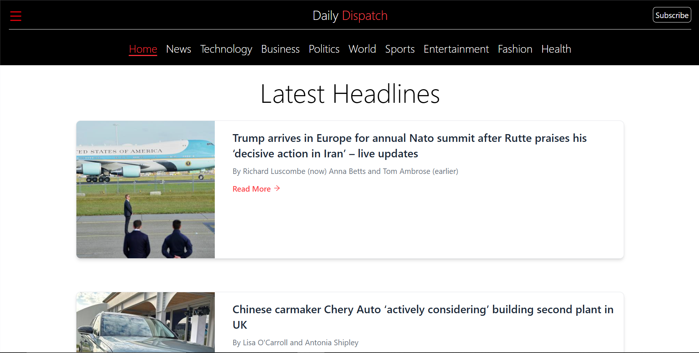
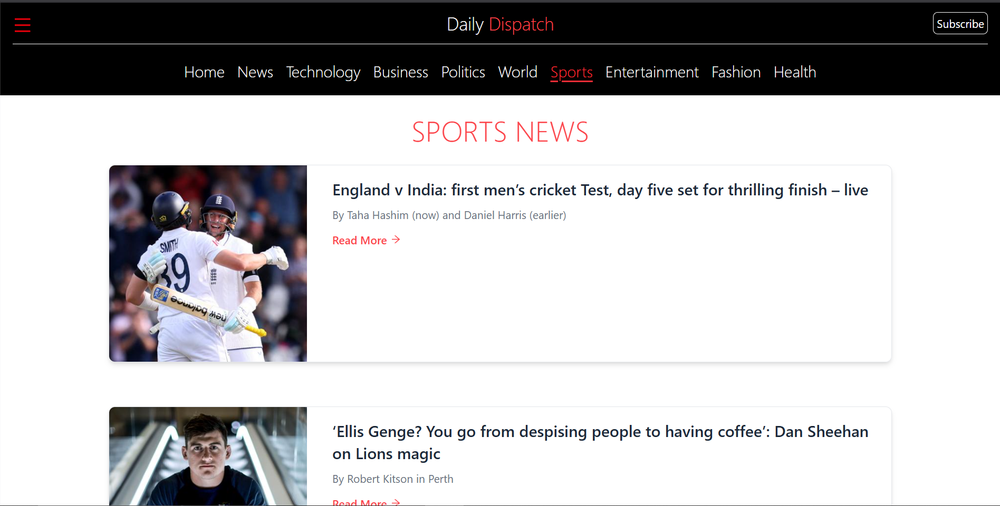
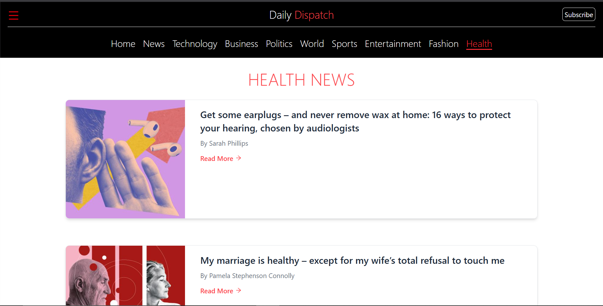
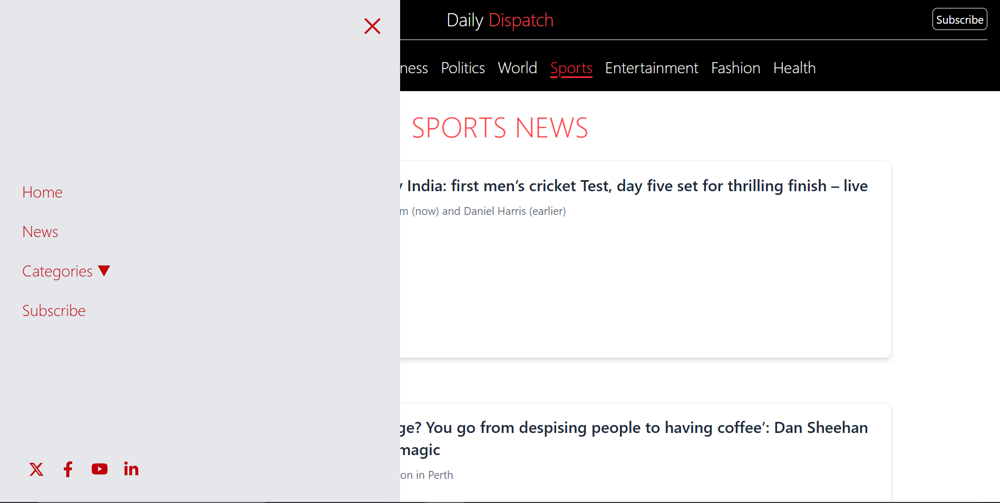

# 📰 Daily Dispatch

**Daily Dispatch** is a responsive, modern news web application built using **React + Vite** that delivers the latest headlines from categories such as Technology, Business, Politics, World, Sports, Entertainment, Fashion, and Health. The application fetches real-time news content using **The Guardian Open Platform API**.


---

## 📌 Features

- ✅ Latest headlines from various news categories
- 📸 News thumbnails, summaries, author info, and external links
- 🌐 Responsive and mobile-friendly UI
- 🧭 Intuitive navigation with dedicated category pages
- ⚡ Fast performance using Vite's development server
- 🔍 Clean UI built with Tailwind CSS
- 🔗 Clickable “Read More” links open original Guardian articles

---

## 🛠️ Tech Stack

| Technology       | Usage                          |
|------------------|--------------------------------|
| React            | UI library                     |
| Vite             | Fast build tool                |
| Axios            | API data fetching              |
| React Router     | Client-side routing            |
| Tailwind CSS     | Utility-first styling          |
| The Guardian API | News data provider             |

---

## 🧪 Live Demo

🚀 Deployment via [Netlify](https://onkar-dhingra-daily-dispatch.netlify.app/)

---

## 🔑 Getting Started

### 1. Clone the Repo

```bash
git clone https://github.com/onkardhingra2087/daily-dispatch.git
cd daily-dispatch
2. Install Dependencies
bash
Copy code
npm install
3. Create .env File
Create a .env file in the root and add your Guardian API key:

env
Copy code
VITE_GUARDIAN_API=your_guardian_api_key
📌 You can get a free API key from: https://open-platform.theguardian.com/

4. Run the App
bash
Copy code
npm run dev
Now open http://localhost:5173 to view the app in the browser.

🗂️ Folder Structure
css
Copy code
src/
│
├── Components/
│   ├── Navbar/
│   │   ├── NewsCardSm.jsx
│   │   ├── NewsCardLg.jsx
│   │   └── Headline.jsx
│
├── Pages/
│   ├── Business.jsx
│   ├── Technology.jsx
│   ├── Sports.jsx
│   ├── World.jsx
│   └── etc...
│
├── App.jsx
├── main.jsx
└── requests.js
📷 Screenshots





🌐 API Reference
Using the Guardian Content API (Open Platform):

Base URL: https://content.guardianapis.com/search

Params used:

order-by=newest

show-fields=thumbnail,trailText,byline

q=technology|sports|politics etc.

api-key=your_key

📄 License
This project is licensed under the MIT License.

🙌 Acknowledgments
The Guardian Open Platform

React

Vite

Tailwind CSS

💡 Future Improvements
🔎 Add search functionality

🌍 Support for regional news filters

🧑‍🤝‍🧑 User authentication and personalization

🗞 Bookmark or Save for later

Made with ❤️ by Onkar Dhingra

yaml
Copy code

---

Let me know if you'd like a minimal version or want to automatically generate badges